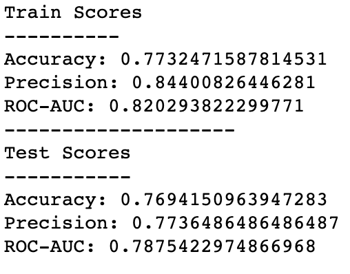
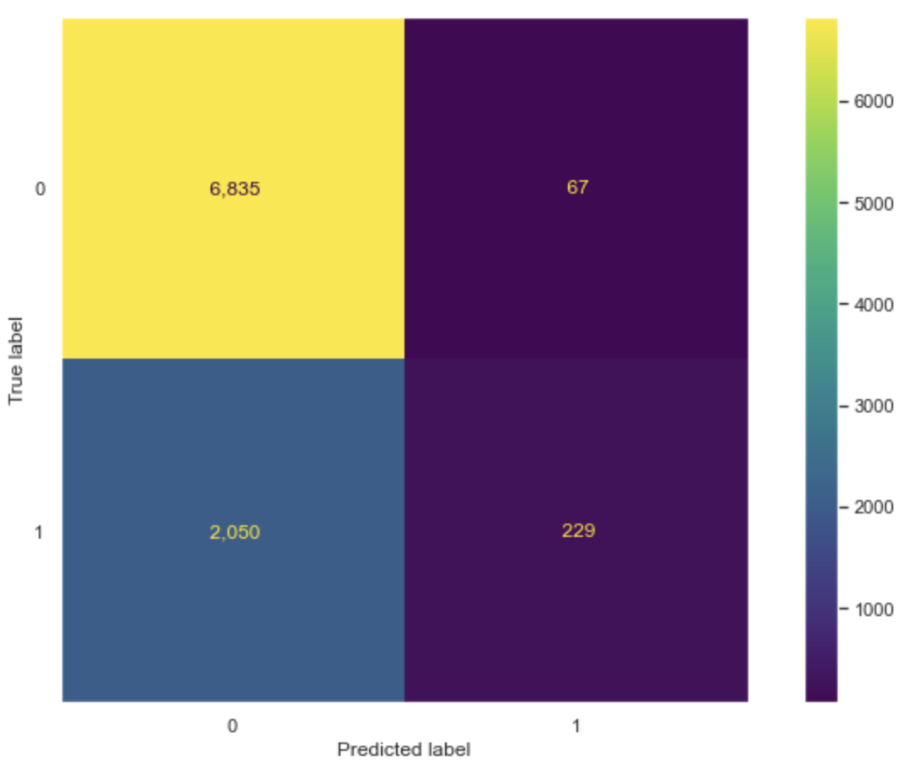

# NYC Airbnb Analysis
**Author**: Jennifer Ha

## Overview
This project analyzes New York City Airbnb listings data for the last 12 months (August 2020 - July 2021), which includes detailed information about the hosts and the listings. For the purpose of this project, the Airbnb marketing team would like to know which listings are valuable enough to be selected for their NYC promotion page in the coming winter. With the strong vaccination rate and eased Covid-19 regulation in the city, the team expects that more visitors would be looking for a place to stay in NYC moving forward. Since they cannot go over and compare each listing one by one, the team is looking for a prediction model that they can rely on to carefully select valuable listings that they can promote. They further anticipate to rely on the selected model from this analysis for their future promotions as well.

To help the Airbnb marketing team with accurately selecting the valuable listings in NYC, I'll be comparing classification models and further optimize the best performing model.
***
## Business Problem
The goal of this analysis is to predict whether a listing is valuable or not. The Airbnb marketing team has decided to consider top 25% listings as valuable, and have asked to calculate a weighted review scores rating to reward listings with more number of reviews and penalize listings with less number of reviews.

The team should be able to use the best model from this analysis to decide which listings are valuable and should be promoted to people who are searching for a place to stay when they visit New York City. We will focus on accuracy, precision, and ROC-AUC scores to determine which model performs the best. In this problem, accurately identifying a valuable listing is important as we cannot falsely advertise a listing with poor ratings.
***
## Data
The dataset has 74 columns and 36,722 rows of New York City Airbnb listings data from August 2020 - July 2021. Each feature contains detailed information about the host and the listing, and we will be exploring each of them to decide which relevant features to keep for this project. The final DataFrame we will be working with will have 16 feature columns with the same number of rows as we remove IDs, URLs, and repetitive information.

The target variable we would like to predict is `weighted_review_scores_rating`, which we will calculate using the number of reviews and review scores provided in the original dataset. Then, we will convert it to binomial, 0 = No (not valuable), 1 = Yes (valuable). Class imbalance is expected since we will consider the top 25% of the listings as valuable.
***
## Methods
This project explores 5 different machine learning model types using the SKLearn package: logistic regression, K-Nearest Neighbors, Decision Tree, Random Forest, and Adaboost. Due to overfitting problem, I've decided not to move forward with K-Nearest Neighbors, Decision Tree, and Random Forest models. To further improve the performance, hyperparameter tuning was performed on logistic regression and Adaboost models.
***
## Results
Our winning model is the last model we ran in this project, which is a gradient boosting model with hyperparameter tuning to improve precision. This model is the best as we were able to increase the precision by 18.5% with almost no sacrifice to the accuracy and ROC-AUC score. This model also shows that it has the highest threshold when deciding whether a listing is valuable or not, allowing the least room for errors for the Airbnb marketing team when promoting the top 25% listings.




***
## Next Steps
1. **Understand what features make a listing valuable.** Now that we have a model that can help the team to select top 25% listings with the best weighted review scores rating, we can also potentially explore different features to understand which ones have the most impact. As a medium that connects the hosts and the guests, it would be very beneficial for the team and the company to know what connects these two audiences. Having more valuable listings and having a better standard of their listing selections will attract more guests to find a place to stay through Airbnb.

2. **Re-visit over-fitting models and think about how we can reduce the over-fitting.** While we were able to create a model that we could rely on, I think there is still a chance to further improve the models that we didn't move forward with or that didn't yield the best performance. We won't know the answer until we finish exploring but this can be an interesting study as the best model we have is not the most perfect model.

3. **Consider expanding this project to make predictions using global data.** This project explores the last 12 months of listing data in NYC only and I believe we can expand the business learnings by including listing data from other cities across the globe. Airbnb is a global company that many people use, and there are many other cities people visit every year. The best model we built from this project might not be directly applicable but the iteration process can still be applied. Such a process will help Airbnb to select the most valuable listings very efficiently, which will also provide a better understanding with their overall listings as well as the valuable listings globally.


## For More Information
See the full analysis in the [Jupyter Notebook](https://github.com/jennifernha/NYC-Airbnb-Analysis/blob/main/NewYork-Airbnb-Analysis.ipynb) or review this [presentation](https://github.com/jennifernha/NewYork-Airbnb-Analysis/blob/main/Presentation.pdf).
For additional info, contact Jennifer Ha at jnha1119@gmail.com
***
## Repository Structure
```
├── images                        
├── NewYork-Airbnb-Analysis.ipynb   
├── Prensentation.pdf  
├── README.md                           
└── functions.py
  
  